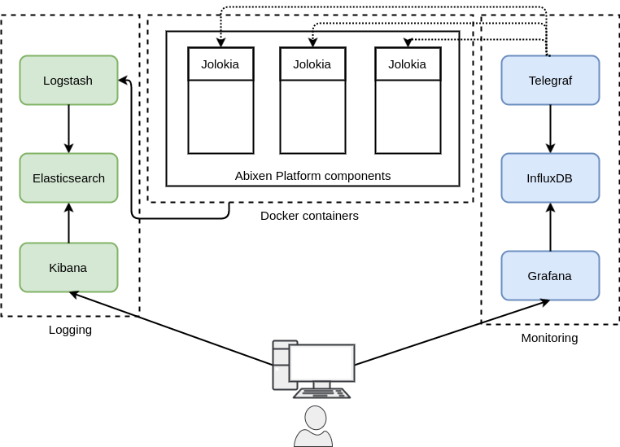

# Running abixen-platform using docker-compose
This config allows you to run **ALL** abixen-platform components.



To run all components with central logging please run docker-compose:

```
docker-compose up -d
```

This will consume around **5GB** of your memory and can take a few minutes to start.

# Logging
All containers from abixen-platform send logs to Elasticsearch via Logstash.
You can access Kibana interface using its exposed port on [http://localhost:5601](http://localhost:5601).


## Elasticsearch workaround
If you encounter an error similar to this one (on Linux platform)

```
elasticsearch_1 | ERROR: bootstrap checks failed
elasticsearch_1 | max virtual memory areas vm.max_map_count [65530] is too low, increase to at least [262144]
```

then you need to run the following command:

```
sudo sysctl -w vm.max_map_count=262144
```

# Monitoring
All metrics are exposed on each component with [Jolokia](http://jolokia.org) and fetched from there using [Telegraf](https://influxdata.com/telegraf-correlate-log-metrics-data-performance-bottlenecks/). They are sent to [InfluxDB](https://influxdata.com/) and are accessible on [Grafana](https://grafana.net) dashboards

## Running
All monitoring components run as docker containers defined in [monitoring/](monitoring/) directory.
To run it you need to launch them using docker-compose:

```
cd monitoring
docker-compose up -d
```

Grafana is available at [http://localhost:3000](http://localhost:3000). Select **Abixen platform** from a list of dashboards. Diagrams can be used without logging, but you can still use default credentials:

  * Login: admin
  * Password: admin


